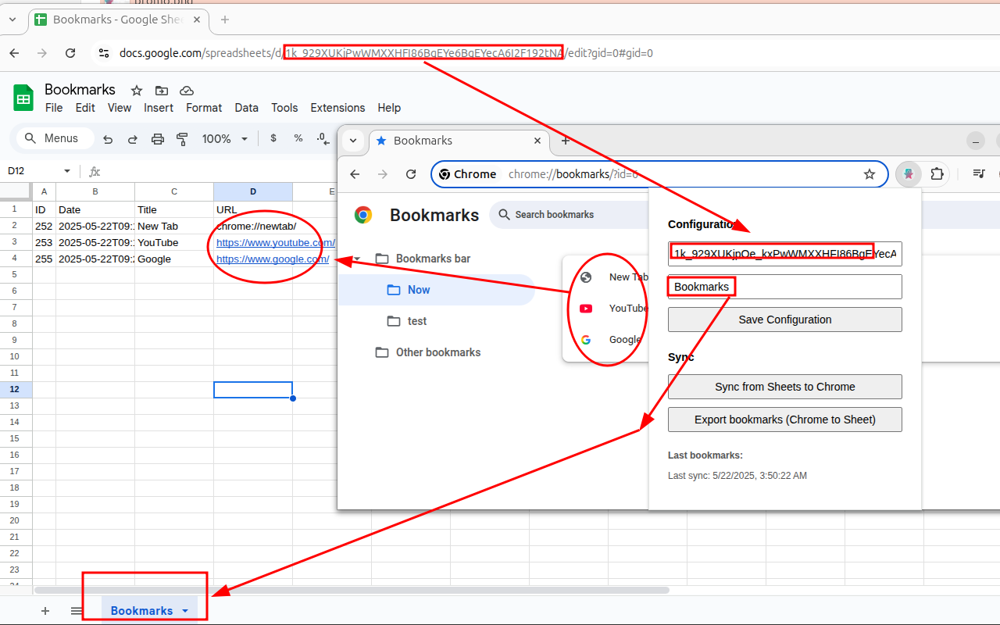

# Bookmark Sync to Google Sheets (Chrome Extension)

Automatically sync your Chrome bookmarks with a Google Sheets spreadsheet. Ideal for backup, sharing favorites, or managing links from the cloud.

## 🚀 Main Features

- ✅ Automatic sync Chrome → Google Sheets (when you add or delete a bookmark)
- ✅ Manual sync Google Sheets → Chrome (button in the popup)
- ✅ Full export of all current bookmarks to Sheets (optional)
- ✅ Duplicate prevention using URL as key
- ✅ Configuration from the popup (Sheet ID and sheet name)
- ✅ Notifications if configuration is missing
- ✅ Visual interface with sync status

## 📦 Installation

1. Clone this repository or download as ZIP.
2. Go to `chrome://extensions/`
3. Enable developer mode.
4. Click "Load unpacked" and select the project folder.

## 🛠 Initial Setup

1. Click the extension icon to open the popup.
2. Enter your **Spreadsheet ID** and **sheet name**.
3. Save the changes.
4. The extension is now ready to sync.

## 📌 Recommended Sheet Structure

Your sheet should have the following headers:
A: ID | B: Date | C: Title | D: URL

The sheet name must match the one you set in the configuration (e.g., `Bookmarks`).

## 📥 Popup Functions

- **Sync from Sheets**: Pulls changes from the sheet to Chrome.
- **Export current bookmarks**: Uploads all your current bookmarks to Sheets.
- Shows the last synced bookmarks and the time of the last sync.

## 🛡 Required Permissions

- `bookmarks`: to access your bookmarks
- `identity`: to authenticate with your Google account
- `storage`: to save configuration
- `notifications`: to show alerts if configuration is missing

## 📄 License

MIT. Use, improve, and share without restrictions.

Note: add your client id: YOUR_CLIENT_ID in manifest.json.
Example: 00000000-sadknasjdajdnbajn.apps.googleusercontent.com
